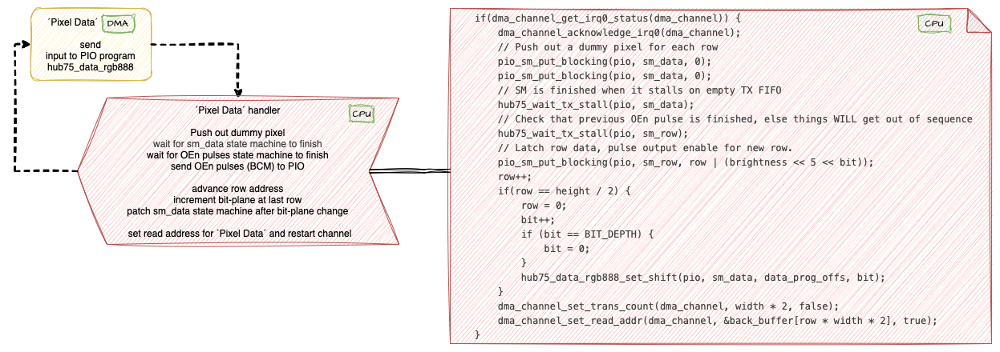
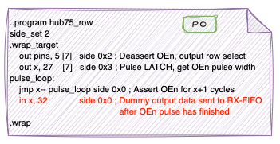
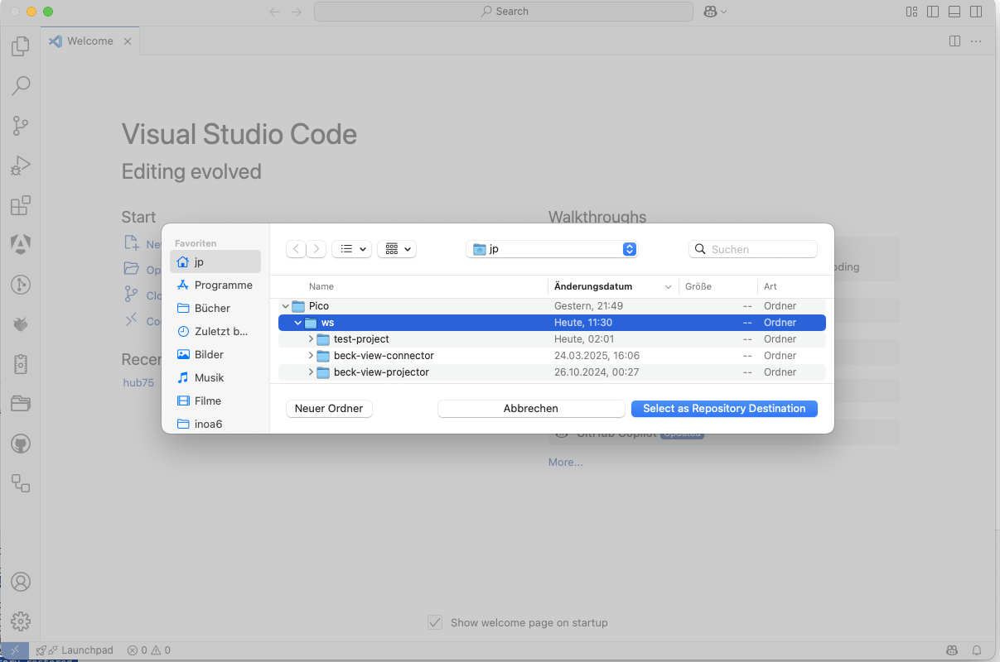
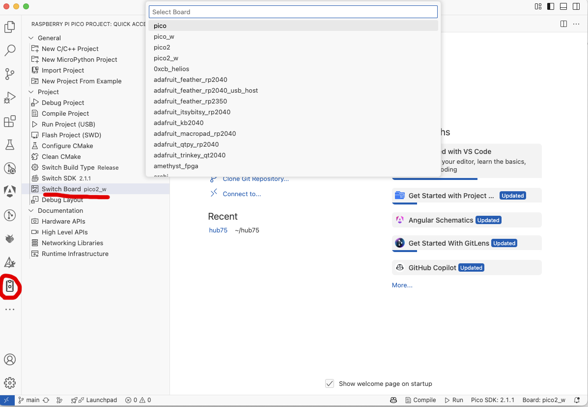
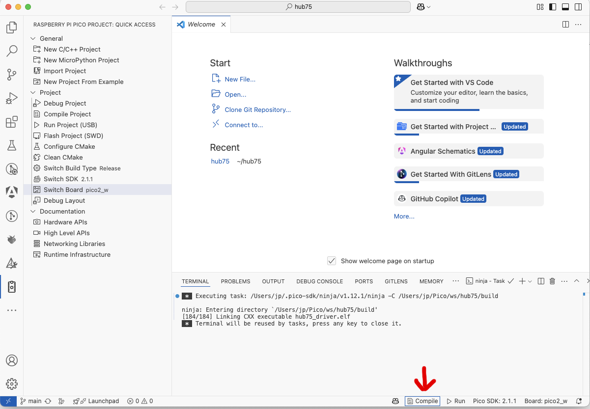
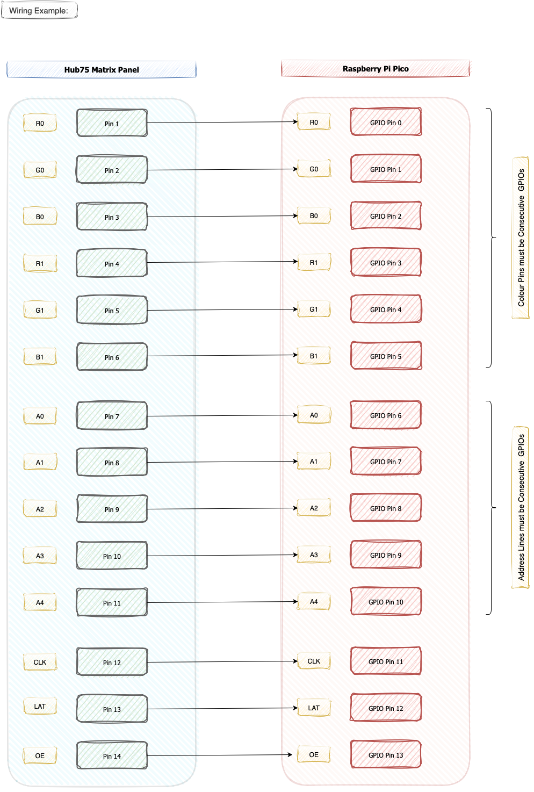

- [HUB75 DMA-Based Driver](#hub75-dma-based-driver)
  - [Documentation and References](#documentation-and-references)
  - [Hub75 Matrix Panel Driver Version 3.0](#hub75-matrix-panel-driver-version-30)
  - [Achievements at a Glance](#achievements-at-a-glance)
    - [Version 2 — DMA/PIO Pipeline](#version-2--dmapio-pipeline)
    - [Version 3.0 — Colour Fidelity \& Signal Integrity](#version-30--colour-fidelity--signal-integrity)
  - [Motivation](#motivation)
  - [Evolution of Pico HUB75 Drivers](#evolution-of-pico-hub75-drivers)
    - [Raspberry Pi Pico HUB75 Example](#raspberry-pi-pico-hub75-example)
    - [Pimoroni HUB75 Driver](#pimoroni-hub75-driver)
  - [Eliminating `hub75_wait_tx_stall`](#eliminating-hub75_wait_tx_stall)
    - [Original `hub75_wait_tx_stall` Implementation](#original-hub75_wait_tx_stall-implementation)
    - [Alternative Approach](#alternative-approach)
  - [DMA Chains and PIO State Machines in the Revised HUB75 Driver](#dma-chains-and-pio-state-machines-in-the-revised-hub75-driver)
    - [Overview](#overview)
    - [Step-by-Step Breakdown](#step-by-step-breakdown)
  - [The Definitive Hub75 Driver Solution – A Bitplane Stream with Parallel Reading and Display of Pixel Data](#the-definitive-hub75-driver-solution--a-bitplane-stream-with-parallel-reading-and-display-of-pixel-data)
    - [Overview of the Redesigned Alternative Approach](#overview-of-the-redesigned-alternative-approach)
    - [High-Level Architectural View of HUB75 Pipeline](#high-level-architectural-view-of-hub75-pipeline)
    - [1. Canonical Mapping Stage (`update()` / `update_bgr()`)](#1-canonical-mapping-stage-update--update_bgr)
    - [2. The New Hardware Pipeline](#2-the-new-hardware-pipeline)
    - [3. Simplified DMA Structure](#3-simplified-dma-structure)
    - [4. Advanced Signal Integrity \& Anti-Ghosting](#4-advanced-signal-integrity--anti-ghosting)
    - [5. Efficient BCM with Split-Bitplanes](#5-efficient-bcm-with-split-bitplanes)
    - [Step-by-Step Breakdown of DMA and PIO Cooperation](#step-by-step-breakdown-of-dma-and-pio-cooperation)
      - [RGB Pixel Data Transformation into Bitplane Slices](#rgb-pixel-data-transformation-into-bitplane-slices)
      - [Row-Addressing, Loading and Display of Pixel Data](#row-addressing-loading-and-display-of-pixel-data)
    - [Refresh Rate Performance](#refresh-rate-performance)
    - [Key Benefits of this Approach](#key-benefits-of-this-approach)
  - [Conclusion for DMA and PIO based Approach](#conclusion-for-dma-and-pio-based-approach)
  - [Improved Colour Perception](#improved-colour-perception)
    - [Balanced Light Output](#balanced-light-output)
      - [Example: 10-bit color depth (`BITPLANES=10`)](#example-10-bit-color-depth-bitplanes10)
      - [Visual comparison](#visual-comparison)
  - [Colour Correction Matrix](#colour-correction-matrix)
    - [Overview](#overview-1)
    - [Two-Stage Colour Pipeline](#two-stage-colour-pipeline)
    - [Mathematical Model](#mathematical-model)
    - [Implementation](#implementation)
    - [Configuration via `CMakeLists.txt`](#configuration-via-cmakeliststxt)
    - [The `cie.py` LUT Generator](#the-ciepy-lut-generator)
    - [Tuning Procedure](#tuning-procedure)
      - [Step 1 — Establish a baseline](#step-1--establish-a-baseline)
      - [Step 2 — Use a grey-ramp test image](#step-2--use-a-grey-ramp-test-image)
      - [Step 3 — Tune one term at a time](#step-3--tune-one-term-at-a-time)
      - [Step 4 — Verify with saturated primaries](#step-4--verify-with-saturated-primaries)
      - [Step 5 — Check with a real image](#step-5--check-with-a-real-image)
      - [Step 6 — Final white-balance trim](#step-6--final-white-balance-trim)
    - [Runtime Cost](#runtime-cost)
  - [Brightness Control](#brightness-control)
    - [API Functions](#api-functions)
    - [How it Works](#how-it-works)
    - [Default Settings](#default-settings)
    - [Practical Notes](#practical-notes)
  - [Chained Panels](#chained-panels)
    - [Topology Overview](#topology-overview)
    - [Configuration Parameters](#configuration-parameters)
      - [Chain Modes](#chain-modes)
    - [CMakeLists.txt Example](#cmakeliststxt-example)
    - [Source Buffer Layout](#source-buffer-layout)
    - [How Serpentine Reversal Works Internally](#how-serpentine-reversal-works-internally)
    - [Single-Panel Optimisation](#single-panel-optimisation)
    - [Supported Panel Types and Chaining](#supported-panel-types-and-chaining)
    - [Memory Considerations](#memory-considerations)
    - [Quick-Reference: Common Configurations](#quick-reference-common-configurations)
  - [Demo Effects](#demo-effects)
  - [How to Use This Project in VSCode](#how-to-use-this-project-in-vscode)
  - [Next Steps](#next-steps)
- [Prerequisites for the Hub75 Driver](#prerequisites-for-the-hub75-driver)
  - [Wiring Details](#wiring-details)
    - [Colour Data Pins](#colour-data-pins)
    - [Address (Row Select) Pins](#address-row-select-pins)
    - [Control Pins](#control-pins)
    - [One Glance Mapping HUB75 Connector → Pico GPIOs](#one-glance-mapping-hub75-connector--pico-gpios)
  - [Allowed Deviations  ](#allowed-deviations--)
    - [Example: Custom Pin Mapping](#example-custom-pin-mapping)
- [Configuration via CMakeLists.txt](#configuration-via-cmakeliststxt-1)
  - [Overview](#overview-2)
  - [All Available Defines and Their Default Values](#all-available-defines-and-their-default-values)
  - [Full CMakeLists.txt Example](#full-cmakeliststxt-example)
  - [Notes on Default Values](#notes-on-default-values)
- [Configuring Your HUB75 LED Matrix Panel](#configuring-your-hub75-led-matrix-panel)
  - [Step 1 — Panel Dimensions](#step-1--panel-dimensions)
    - [Wiring](#wiring)
  - [Step 2 — Scan Rate and Rows Lit Simultaneously](#step-2--scan-rate-and-rows-lit-simultaneously)
    - [Rule](#rule)
    - [Examples](#examples)
      - [Panel with 64×64 height and width, 1/32 scan (-32S-), 5 Address lines (A, B, C, D, E) -\> (2 rows lit)](#panel-with-6464-height-and-width-132-scan--32s--5-address-lines-a-b-c-d-e---2-rows-lit)
      - [Panel with 32×64 height and width, 1/16 scan (-16S-), 4 Address lines (A, B, C, D) -\> (2 rows lit)](#panel-with-3264-height-and-width-116-scan--16s--4-address-lines-a-b-c-d---2-rows-lit)
  - [Step 3 — Panel Pixel Mapping Type](#step-3--panel-pixel-mapping-type)
    - [Configuration Examples](#configuration-examples)
  - [Step 4 — Panel Driver Chip Type](#step-4--panel-driver-chip-type)
    - [How to choose](#how-to-choose)
  - [Step 5 — Strobe Polarity (`INVERTED_STB`)](#step-5--strobe-polarity-inverted_stb)
  - [Step 6 — State Machine Clock Divider (`SM_CLOCKDIV`)](#step-6--state-machine-clock-divider-sm_clockdiv)
    - [Pixel Mapping](#pixel-mapping)
      - [How Pixel Mapping Works (General Idea)](#how-pixel-mapping-works-general-idea)
      - [`HUB75_MULTIPLEX_2_ROWS` Mapping](#hub75_multiplex_2_rows-mapping)
      - [`HUB75_P10_3535_16X32_4S` Mapping](#hub75_p10_3535_16x32_4s-mapping)
      - [`HUB75_P3_1415_16S_64X64_S31` Mapping](#hub75_p3_1415_16s_64x64_s31-mapping)
    - [Practical Notes](#practical-notes-1)
- [Troubleshooting](#troubleshooting)
  - [1. Panel Stays Completely Dark](#1-panel-stays-completely-dark)
    - [Check the obvious first](#check-the-obvious-first)
    - [Configuration checks](#configuration-checks)
  - [2. Panel Lights Up, But Only Shows Noise or Garbage](#2-panel-lights-up-but-only-shows-noise-or-garbage)
    - [What to check](#what-to-check)
    - [Typical symptoms](#typical-symptoms)
  - [3. Image Looks Correct, But Rows Are Missing or Repeated](#3-image-looks-correct-but-rows-are-missing-or-repeated)
    - [Check](#check)
    - [Rule reminder](#rule-reminder)
  - [4. Image Is Correct but Flickers or Shows Ghosting](#4-image-is-correct-but-flickers-or-shows-ghosting)
    - [Things to try](#things-to-try)
    - [Also check](#also-check)
  - [5. Panel Updates Sporadically or Only Every Few Frames](#5-panel-updates-sporadically-or-only-every-few-frames)
  - [6. Colors Look Wrong or Are Too Dim / Too Bright](#6-colors-look-wrong-or-are-too-dim--too-bright)
    - [Check](#check-1)
    - [How to verify](#how-to-verify)
  - [7. When Nothing Makes Sense Anymore 😄](#7-when-nothing-makes-sense-anymore-)
  - [Boards](#boards)
      - [Configuration](#configuration)

# HUB75 DMA-Based Driver

<https://github.com/user-attachments/assets/7c41193c-c724-4fae-8823-af36d70fcedd>

*Demo video: Colours are much brighter and more brilliant in reality*

## Documentation and References

This project is based on:

- [Raspberry Pi's pico-examples/pio/hub75](https://github.com/raspberrypi/pico-examples)
- [Pimoroni's HUB75 driver](https://github.com/pimoroni/pimoroni-pico/tree/main/drivers/hub75)

To understand how RGB matrix panels work, refer to the article **[Everything You Didn't Want to Know About RGB Matrix Panels](https://news.sparkfun.com/2650)**.
For details on Binary Coded Modulation (BCM), see **[LED Dimming Using Binary Code Modulation](https://www.ti.com/lit/an/slva377a/slva377a.pdf)**.

---

## Hub75 Matrix Panel Driver Version 3.0

Version 3.0 is a near-complete rework of the DMA/PIO pipeline. Once started, the driver runs almost entirely in hardware — the CPU is barely involved. Two independent DMA/PIO stages handle all the work: one constructs BCM bitplanes on demand whenever `update()` or `update_bgr()` is called; the other streams the pre-built bitplanes to the panel autonomously and continuously. For the full architectural detail see [The Definitive Hub75 Driver Solution](#the-definitive-hub75-driver-solution--a-bitplane-stream-with-parallel-reading-and-display-of-pixel-data).

## Achievements at a Glance

### Version 2 — DMA/PIO Pipeline

Improvements over the Pimoroni driver:

- **CPU Offloading** — Processing moved from the CPU to DMA and PIO co-processors.
- **Self-paced Pipeline** — Interlinked DMA and PIO processes run without CPU supervision.
- **No Blocking Synchronization** — `hub75_wait_tx_stall` eliminated entirely.
- **Reduced Interrupt Complexity** — Lighter, leaner interrupt handlers.

### Version 3.0 — Colour Fidelity & Signal Integrity

Building on the DMA/PIO foundation, Version 3.0 adds:

- **On-demand Bitplane Construction** — RGB pixel data is decomposed into BCM bitplanes
  by a dedicated DMA/PIO stage, triggered only on `update()` / `update_bgr()`.
  Streaming to the panel runs fully autonomously in the background.
- **Balanced Light Output** — High-weight bitplanes are split into multiple shorter segments,
  spreading illumination evenly across the frame. Effective refresh rate increases significantly;
  visible flicker is eliminated even at low brightness.
- **Per-channel CIE 1931 Correction** — Separate `CIE_RED`, `CIE_GREEN`, `CIE_BLUE` lookup
  tables (generated by `cie.py`) map 8-bit input to 10-bit perceptually linear output,
  with per-channel white-balance scaling via `RED_CAP` / `GREEN_CAP` / `BLUE_CAP`.
- **Colour Correction Matrix (CCM)** — Six integer-shift cross-terms correct spectral bleed
  between channels. Zero floating-point cost; off by default (`shift = 31`).
- **Anti-ghosting & Settling Delays** — Configurable nano-second timing guards
  (`BASE_LATCH_NS`, `BASE_ADDR_NS`, `BASE_OE_NS`) around latch, address, and OE transitions
  eliminate ghosting and edge glimmer at high clock speeds.
- **Double-buffering for both frame and command buffers** — Tear-free updates; the
  `row_cmd_buffer` is only swapped when brightness actually changes.
- **`cie.py` generates the full `cie.hpp`** — The LUT generator now emits the complete
  header file including all `#if SEPARATE_CIE_CHANNELS` / `#if BITPLANES` preprocessor
  guards. Run once, redirect to file, done:
```bash
  python3 utils/cie.py > cie.hpp
```

Together these enhancements deliver a display pipeline that is faster, more visually accurate, and almost entirely autonomous — leaving the CPU free for application logic.

---

## Motivation

As part of a private project, I sought to gain deeper knowledge of the Raspberry Pi Pico microcontroller.
I highly recommend **[Raspberry Pi Pico Lectures 2022 by Hunter Adams](https://youtu.be/CAMTBzPd-WI?feature=shared)**—they provide excellent insights!
If you are specifically interested in **PIO (Programmable Input/Output)**, start with [Lecture 14: Introducing PIO](https://youtu.be/BVdaw56Ln8s?feature=shared) and [Lecture 15: PIO Overview and Examples](https://youtu.be/wet9CYpKZOQ).

Inspired by Adams' discussion on **[DMA](https://youtu.be/TGjUHChO1kM?feature=shared&t=1475) and PIO co-processors**, I choose to optimise the Hub75 driver as a self-assigned challenge.

😊 **[Raspberry Pi Pico Lectures 2025 by Hunter Adams](https://youtu.be/a4uLrfqHZQU?feature=shared")** is available now!

---

## Evolution of Pico HUB75 Drivers

You can skip straight to [The Definitive Hub75 Driver Solution](https://github.com/JuPfu/hub75#the-definitive-hub75-driver-solution--a-bitplane-stream-with-parallel-reading-and-display-of-pixel-data) if the evolution of the driver is not your thing.

### Raspberry Pi Pico HUB75 Example

The **Pico HUB75 example** demonstrates connecting an **HUB75 LED matrix panel** using PIO. This educational example prioritizes clarity and ease of understanding.

- The color palette is generated by modulating the **Output Enable (OE)** signal.
- **Binary Coded Modulation (BCM)** is applied row-by-row, modulating all color bits before advancing to the next row.
- Synchronization depends on `hub75_wait_tx_stall`.
- **No DMA is used**, leading to lower performance.

### Pimoroni HUB75 Driver

The **Pimoroni HUB75 driver** improves performance by:

- Switching from **row-wise** to **plane-wise** modulation handling.
- Using **DMA** to transfer pixel data to the PIO state machine.
- Still relying on `hub75_wait_tx_stall` for synchronization.



*Picture 1: Pimoroni's Hub75 Driver DMA Section*

---

## Eliminating `hub75_wait_tx_stall`

Both the **Raspberry Pi and Pimoroni** implementations use `hub75_wait_tx_stall`, which ensures:

- The state machine **stalls** on an empty TX FIFO.
- The system **waits** until the OEn pulse has finished.

However, this blocking method **prevents an efficient DMA-based approach**.

### Original `hub75_wait_tx_stall` Implementation

```c
static inline void hub75_wait_tx_stall(PIO pio, uint sm) {
    uint32_t txstall_mask = 1u << (PIO_FDEBUG_TXSTALL_LSB + sm);
    pio->fdebug = txstall_mask;
    while (!(pio->fdebug & txstall_mask)) {
        tight_loop_contents();
    }
}
```

### Alternative Approach

Instead of waiting for TX FIFO stalling, we can:

1. Modify the **PIO program** to emit a signal once the OEn pulse completes.
2. Set up a **DMA channel** to listen for this signal.
3. Establish an **interrupt handler** to trigger once the signal is received.

This approach allows fully **chained DMA execution** without CPU intervention.



*Picture 2: Modified hub75_row Program*

---

## DMA Chains and PIO State Machines in the Revised HUB75 Driver

### Overview

The following diagram illustrates the interactions between **DMA channels** and **PIO state machines**:

```
[ Pixel Data DMA ] -> [ hub75_data_rgb888 PIO ]
       |
       |--> [ Dummy Pixel Data DMA ] -> [ hub75_data_rgb888 PIO ]
                  |
                  |--> [ OEn Data DMA ] -> [ hub75_row PIO ]
                           |
                           |--> [ OEn Finished DMA ] (Triggers interrupt)
```

### Step-by-Step Breakdown

1. **Pixel Data Transfer**
   - Pixel data is streamed via **DMA** to the **hub75_rdata_gb888** PIO state machine.
   - This handles shifting pixel data into the LED matrix.

2. **Dummy Pixel Handling**
   - A secondary **dummy pixel DMA channel** adds additional pixel data.
   - This ensures correct clocking of the final piece of genuine data.

3. **OEn Pulse Generation**
   - The **OEn data DMA channel** sends 32-bit words - 5 bit address information (row select) and 27 bit puls width - to the **hub75_row** PIO state machine.
   - This output enable signal switches on those LEDs in the current row with bit set in the current bitplane for the specified number of cycles.

4. **Interrupt-Driven Synchronization**
   - A final **OEn finished DMA channel** listens for the end of the pulse.
   - An **interrupt handler** (`oen_finished_handler`) resets DMA for the next cycle.


*Picture 3: Chained DMA Channels and assigned PIOs*

---

## The Definitive Hub75 Driver Solution – A Bitplane Stream with Parallel Reading and Display of Pixel Data

### Overview of the Redesigned Alternative Approach

A (nearly) complete rework of the DMA/PIO pipeline has been done. In this context, I removed some features, such as temporal dithering, and added new ones, such as **Balanced Light Output** and did implement **[board707´s](https://github.com/board707)** suggestion of parallel loading of data while BCM is running.

In addition to **[Pimoroni’s anti-ghosting](https://github.com/pimoroni/pimoroni-pico/commit/9e7c2640d426f7b97ca2d5e9161d3f0a00f21abf)**, a “cooling-off period” for the line decoder has been incorporated after the address is set. Precise timing values in nano-seconds can be specified via compile time definitions in CMakeLists.txt. This applies to the the wait time to stabilise latch, the wait time to stabilise row addressing, and pre-Oe guard wait time to prevent ghost flashes. The matrix panels available to me show no ghosting, no flickering, and no glimmering of pixels at the edges of the matrix even in dark environments.

The output quality has improved due to the usage of Balanced Light Output. That is, bit planes with high weight are divided into several smaller segments within the BCM sequence. This increases the effective refresh rate and reduces flickering.

An interrupt handler is used to support the conversion of rgb pixel data into bitplane slices. At the end of the update() and update_bgr() methods the bitplane slices are constructed heavily relying on DMA and PIO support. This is in stark contrast to the previous version where this had been done on the fly for every frame. The result is a stream of bitplane slices pushed to the matrix panel in a highly efficient manner.

Another interrupt handler is called once per frame. This interrupt handler is responsible for double-buffer administration (pointer switching) of the frame_buffer and double-buffering of the row_cmd_buffer. Both buffers are switched only when necessary. The row_cmd_buffer only when a brightness change has been made, and the frame_buffer when update or update_bgr is called.

### High-Level Architectural View of HUB75 Pipeline

```
CPU part - usually done in 60Hz or 100Hz frequency

[Input 8-bit RGB via update(...) or update_bgr(...) method]
        ↓
[Double Buffered Frame Buffer]
        ↓
[CIE → 10-bit or 8-bit linear light]
        ↓
[Color Correction Matrix (per channel)]
        ↓
[Pixel Mapping / Layout Transform]
        ↓
DMA & PIO part - usually runs at much higher frequency than the CPU part

[Bitplane Extraction Engine (DMA- and PIO-based with a bitplane sequence optimised for the balanced light output strategy)]
        ↓
[DMA → PIO Row Engine (OE / LAT / ADDR)] ← → [DMA → PIO Engine for bitplane row streaming]
        ↓
[Matrix Panel]
```

The driver has transitioned from a CPU-intensive real-time mapping approach to a structured, three-stage hardware pipeline. This change significantly reduces CPU overhead.

### 1. Canonical Mapping Stage (`update()` / `update_bgr()`)
* **Panel-Specific Normalization:** All panel-specific quirks (scan-mode, physical row mapping, and ZigZag patterns) are handled during the initial copy to `rgb_buffer`.
* **Standardized Format:** The buffer is organized into a "canonical" 32-bit RGB format, allowing the subsequent PIO stages to remain generic and extremely fast.

### 2. The New Hardware Pipeline
The data flow is now managed by three specialized PIO programs working in concert:

| Component | Role | Mechanism |
| :--- | :--- | :--- |
| **`hub75_bitplane_setup`** | **Bit-Slicing** | Converts the canonical `rgb_buffer` into the bit-plane structured `frame_buffer`. |
| **`hub75_bitplane_stream`** | **Data Feeding** | Streams the prepared bit-planes to the panel's shift registers. |
| **`hub75_row`** | **Timing & Logic** | The "Master" State-Machine (SM). Handles Row Addressing (A-E), BCM timing, and Latch (STB) signals. |

### 3. Simplified DMA Structure
The DMA logic has been streamlined. Instead of complex per-row interrupts, the system now uses **DMA Chaining**:
* **Autonomous Frames:** DMA channels now loop through all bit-planes and rows automatically.
* **Minimal CPU Interrupts:** The Interrupt Handler is now only called **once per frame**. 
  
  It handles:
    1. **Double-Buffering:** Swapping `frame_buffer` and `row_cmd_buffer` only when a full frame is complete.
    2. **Runtime Updates:** Activating new BCM cycles if brightness was changed via the API.

### 4. Advanced Signal Integrity & Anti-Ghosting
The `hub75_row` program now includes specific hardware-level timing improvements:
* **Anti-Ghosting Wait Cycles:** A configurable `wait_loop` is executed after the Latch (STB) signal but before enabling the next row. This ensures the LEDs from the previous row have fully discharged, eliminating the "shadow" or "ghost" effect common in high-speed multiplexing.
* **Settling Buffers:** Added precise timing padding around the Address (A-E) and Strobe transitions to account for cable capacitance and level-shifter propagation delays.
* **Hardware Synchronization:** `hub75_row` and `hub75_bitplane_stream` are hardware-locked via PIO IRQ flags, ensuring that row switching never occurs while data is still being shifted.

### 5. Efficient BCM with Split-Bitplanes
* **Balanced Light Output:** High-weight bit-planes are split into multiple smaller slices within the BCM sequence. This increases the effective refresh rate and eliminates visible flicker, even at low intensity settings.
* **Constant Frame Rate:** The sum of `lit_cycles` and `dark_cycles` is kept constant, ensuring a rock-solid refresh rate regardless of brightness levels.

### Step-by-Step Breakdown of DMA and PIO Cooperation

Two independent DMA/PIO pipelines do the "background" work in the **Definitive Hub75 Driver Solution**.

The first DMA/PIO pipeline transforms the RGB pixel data into bitplane slices. This is done <em>On Demand</em> whenever the <code>update(...)</code> or <code>update_bgr(...)</code> method is called by the user.

The second DMA/PIO pipeline streams the bitplanes to the matrix panel.  Each row in the bitplane has its address and on/off BCM duration supplied from a precalculated structure which is read via DMA. Loading of pixel data (bitplanes) and BCM are done in parallel.

#### RGB Pixel Data Transformation into Bitplane Slices


*Picture 4: Bitplane Creation Pipeline*

#### Row-Addressing, Loading and Display of Pixel Data


*Picture 5: Row-Addressing, Pixel Loading and BCM*

### Refresh Rate Performance

With a **bit-depth of 10** or a **bit-depth of 8**, the HUB75 driver achieves the following refresh rates for a 64 x 64 standard Hub75 matrix panel with scan mode 2 depending on the system clock and basis brightness settings.

Here some more relevant settings if you want to repeat the measurements and verify the listed frame rates:

```cmake
    SM_CLOCKDIV_FACTOR=1.0f     # to prevent flicker or ghosting it might be worth a try to reduce state machine speed
    BITPLANES=10                # number of bit-planes used for Binary Code Modulation - valid values for BIT_DEPTH are 8 or 10
    BALANCED_LIGHT_OUTPUT=true  # uses some more memory but it improves effective refresh rate and really cuts down flicker
    SEPARATE_CIE_CHANNELS=true  # use separate CIE channels for improved colour representation - needs more memory
    HUB75_MULTICORE=true        # use core1 for the hub75 driver
    FRAME_RATE=true             # emit frame rate information on usb - disable for production usage
``` 

| System Clock | Basis Brightness | Refresh Rate for 10 Bitplanes |  Refresh Rate for 8 Bitplanes |
|--------------|------------------|-------------------------------|-------------------------------|
| 100 MHz      | 8                | ~271 Hz                       | ~519 Hz                       |
| 150 MHz      | 8                | ~398 Hz                       | ~762 Hz                       |
| 200 MHz      | 8                | ~519 Hz                       | ~993 Hz                       |
| 250 MHz      | 8                | ~634 Hz                       | ~1216 Hz                      |
| 266 MHz      | 1                | ~1009 Hz                      | ~1285 Hz                      |
| 266 MHz      | 2                | ~1009 Hz                      | ~1285 Hz                      |
| 266 MHz      | 4                | ~951 Hz                       | ~1285 Hz                      |
| 266 MHz      | 8                | ~670 Hz                       | ~1285 Hz                      |
| 266 MHz      | 16               | ~412 Hz                       | ~1121 Hz                      |
| 266 MHz      | 32               | ~230 Hz                       | ~751 Hz                       |
| 266 MHz      | 64               | ~121 Hz                       | ~441 Hz                       |
| 266 MHz      | 128              | ~62 Hz                        | ~239 Hz                       |
| 266 MHz      | 255              | ~31 Hz                        | ~124 Hz                       |


These results demonstrate stable operation and high-performance display rendering across a wide range of system clocks.

Overall, performance has improved compared to the predecessor versions. In summary, the following factors are responsible for this:

- pixel data are provided in a bitplane structure and only need to be streamed to the matrix panel
- loading of pixel data (bitplanes) and Binary Coded Modulation (BCM) are done in parallel as proposed by **[board707](https://github.com/board707)**

The performance improvements mainly affect the lower and middle brightness ranges. Starting at a “Base Brightness” of 64 and higher, the BCM component becomes dominant. At that point, even the parallel loading of the pixel data and its provision in a bit-plane structure no longer provides any (significant) speedup.

The revised driver requires slightly more memory resources to achieve the improved quality. I am using “defines” to disable certain (new) functionalities and thus make more memory available for applications.

### Key Benefits of this Approach

✅ Fully **automated** data transfer using **chained DMA channels**.

✅ Eliminates **CPU-intensive** busy-waiting (`hub75_wait_tx_stall`).

✅ Ensures **precise timing** without unnecessary stalling.

---

## Conclusion for DMA and PIO based Approach

By offloading tasks to **DMA and PIO** the definitive HUB75 driver achieves **higher performance**, **simpler interrupt handling**, and **better synchronization**. Especially splitting RGB data into bitplanes **on demand** in a separate **DMA and PIO** step has contributed a great deal to this improvement. This separate step also eased the implementation of **Balanced Light Output**. Overall, this approach has significantly reduced CPU overhead while simultaneously minimizing artifacts such as **ghosting** at high clock speeds.

If you're interested in optimizing **RGB matrix panel drivers**, this implementation serves as a valuable reference for efficient DMA-based rendering.

---

## Improved Colour Perception

The graphics system for the demo effects operates in **RGB888** format (8 bits per channel, 24 bits per pixel). To better match human vision, colours are mapped using the [CIE 1931 lightness curve](https://jared.geek.nz/2013/02/linear-led-pwm/). This mapping effectively expands the usable range to **10 bits per channel**.

The HUB75 driver takes advantage of this: its PIO/DMA pipeline packs each pixel as a **32-bit word** with 10 bits for red, 10 bits for green, and 10 bits for blue.

---

### Balanced Light Output

In standard Binary Code Modulation (BCM), each bitplane is displayed for a duration proportional to its bit weight — the MSB plane stays on for half the entire frame period. At low brightness settings or when the display content changes rapidly, this long uninterrupted ON-period becomes visible as flicker.

**Balanced Light Output** addresses this by splitting high-weight bitplanes into multiple smaller segments, distributing them evenly across the BCM sequence. The total illumination time per bitplane remains identical — only the distribution changes. This increases the effective refresh rate and eliminates visible flicker, even at low brightness levels.

#### Example: 10-bit color depth (`BITPLANES=10`)

Without Balanced Light Output, the BCM sequence processes bitplanes 0–9 in a single pass (10 steps):

```c
// Standard BCM — 10 steps
static const uint8_t BCM_SEQUENCE[] = { 0, 1, 2, 3, 4, 5, 6, 7, 8, 9 };
```

A first step towards **Balanced Light Output** is the reordering of the bitplanes as is done in the current implementation when `BALANCED_LIGHT_OUTPUT` is set to `false`. This already has an effect to mitigate flicker by mixing long and short ON-periods.

```c
// Reordered BCM — 10 steps
static const uint8_t BCM_SEQUENCE[] = { 0, 9, 2, 7, 4, 5, 1, 8, 3, 6 };
```

Enabling `BALANCED_LIGHT_OUTPUT=true` in `CMakeLists.txt` produces a 14-step sequence instead. Bitplane 9 (highest weight) is split into **4 segments**, bitplane 8 into **2 segments** — all other bitplanes appear once:

```c
// Balanced Light Output — 14 steps
static const uint8_t BCM_SEQUENCE[] = {
    9, 0, 1, 2, 8, 3, 4, 9, 5, 9, 6, 8, 7, 9
//  ^           ^        ^     ^     ^     ^
//  |           |        |     |     |     bitplane 9 (4x total)
//  bitplane 9 (1st)     |     bitplane 9 (3rd)
//              |        bitplane 9 (2nd)
//              bitplane 8 (1st)     |
//                                   bitplane 8 (2nd)
};
```

> **Note:** The sum of all BCM cycle durations is identical in both sequences — Balanced Light Output does not affect overall brightness, only the temporal distribution of light.

#### Visual comparison

```
Standard BCM (10 steps):
|0|1|2|3|4|5|6|7|████8████|████████████████9████████████████|
                           ↑ long ON-period → visible flicker

Balanced Light Output (14 steps):
|███9███|0|1|2|██8██|3|4|███9███|5|███9███|6|██8██|7|███9███|
 ↑               ↑          ↑         ↑        ↑        ↑
 MSB segments spread evenly across the frame → no flicker
```

Balanced Light Output improves the *temporal* distribution of light. The next section addresses *spectral* accuracy — correcting the colour cross-channel bleed that makes neutral grey appear tinted on real panels.

## Colour Correction Matrix

### Overview

HUB75 LED matrix panels do not reproduce colour faithfully out of the box. Two independent sources of error contribute to inaccurate colour:

**1. Per-channel luminance non-linearity** — already corrected by the [CIE 1931 lightness curve](https://jared.geek.nz/2013/02/linear-led-pwm/) baked into `CIE_RED`, `CIE_GREEN`, and `CIE_BLUE`. The per-channel white-balance scaling factors `RED_CAP`, `GREEN_CAP`, and `BLUE_CAP` in `cie.py` handle the remaining per-channel gain difference.

**2. Spectral cross-channel bleed** — *not* corrected by the CIE LUTs. Real LEDs emit light across a broader spectrum than their nominal colour. A red LED radiates slightly into the orange-green range; a green LED dominates perceived brightness. The result is that neutral grey (`R = G = B`) appears tinted, saturated colours look shifted, and skin tones are rendered incorrectly.

A **Colour Correction Matrix (CCM)** addresses this second source of error by mixing a small, controlled fraction of each channel's CIE-corrected output into its neighbours. This is the same technique used in professional LED processors and ICC display profiles.

---

### Two-Stage Colour Pipeline

The full colour pipeline works in two consecutive stages, each handling a distinct correction:

```
 8-bit input  ┌─────────────────────────────────────────┐  10-bit output
 R, G, B ───▶ │  Stage 1: CIE LUT + per-channel CAP     │ ──▶ rv, gv, bv
              │  (baked into CIE_RED/GREEN/BLUE)        │
              └─────────────────────────────────────────┘
                                   │
                                   ▼
              ┌─────────────────────────────────────────┐  10-bit output
              │  Stage 2: CCM cross-channel mixing      │ ──▶ rv′, gv′, bv′
              │  (additive, integer shift arithmetic)   │
              └─────────────────────────────────────────┘
                                   │
                                   ▼
                        32-bit packed pixel word
                        (bv′ << 20) | (gv′ << 10) | rv′
```

The two stages are **orthogonal**: the CIE LUT correction and the `RED_CAP` / `GREEN_CAP` / `BLUE_CAP` scaling factors in `cie.py` remain completely unchanged when CCM is enabled. CCM operates on the already CIE- and CAP-corrected 10-bit values.

---

### Mathematical Model

The CCM adds cross-channel contributions using a superposition model:

```
r′ = clamp( rv  +  (gv >> CCM_RG_SHIFT)  +  (bv >> CCM_RB_SHIFT) )
g′ = clamp( gv  +  (rv >> CCM_GR_SHIFT)  +  (bv >> CCM_GB_SHIFT) )
b′ = clamp( bv  +  (rv >> CCM_BR_SHIFT)  +  (gv >> CCM_BG_SHIFT) )
```

Each coefficient is expressed as an integer **right-shift amount**, which avoids floating-point arithmetic entirely. The equivalent fractional contribution is:

| Shift value | Added fraction | Typical use |
|:-----------:|:--------------:|:------------|
| `5`  | ≈ 3.1 % | Strong correction |
| `6`  | ≈ 1.6 % | Moderate correction |
| `7`  | ≈ 0.8 % | Fine correction |
| `8`  | ≈ 0.4 % | Very fine correction |
| `9`  | ≈ 0.2 % | Barely perceptible |
| `31` | = 0.0 % | **Disabled** (identity, no bleed) |

Setting a shift to `31` disables that cross-term completely — a shift of 31 on a 10-bit value always produces zero. All six cross-terms default to `31`, so CCM is **off by default** and introduces no change to the output unless explicitly configured.

---

### Implementation

The CCM is implemented as two macros in `hub75.hpp`, inserted directly after the `SEPARATE_CIE_CHANNELS` preprocessor block:

```cpp
// ---------------------------------------------------------------------------
// Colour Correction Matrix (CCM) — cross-channel mixing
//
// Applied after the CIE LUT lookup, on already CAP-scaled 10-bit values.
// All six cross-terms default to 31 (= disabled, adds zero contribution).
//
// Shift reference:  5 → ~3.1%   6 → ~1.6%   7 → ~0.8%   31 → 0% (off)
// ---------------------------------------------------------------------------

#ifndef CCM_RG_SHIFT
#define CCM_RG_SHIFT 31   // fraction of Green added into Red
#endif
#ifndef CCM_RB_SHIFT
#define CCM_RB_SHIFT 31   // fraction of Blue  added into Red
#endif
#ifndef CCM_GR_SHIFT
#define CCM_GR_SHIFT 31   // fraction of Red   added into Green
#endif
#ifndef CCM_GB_SHIFT
#define CCM_GB_SHIFT 31   // fraction of Blue  added into Green
#endif
#ifndef CCM_BR_SHIFT
#define CCM_BR_SHIFT 31   // fraction of Red   added into Blue
#endif
#ifndef CCM_BG_SHIFT
#define CCM_BG_SHIFT 31   // fraction of Green added into Blue
#endif

#if BITPLANES == 10
#define CCM_MAX_VAL 1023u
#elif BITPLANES == 8
#define CCM_MAX_VAL 255u
#endif

// Branchless saturation — the compiler generates a single USAT or CMP+MOV
// on Cortex-M0+ and M33; no branching, no pipeline stall.
#define CCM_CLAMP(val) ((val) > CCM_MAX_VAL ? CCM_MAX_VAL : (val))

// CCM_APPLY operates in-place on three uint32_t locals rv, gv, bv.
// All cross-terms for a channel are accumulated first, then clamped once.
#define CCM_APPLY(rv, gv, bv)                                           \
    do {                                                                \
        uint32_t _r = (rv) + ((gv) >> CCM_RG_SHIFT)                     \
                           + ((bv) >> CCM_RB_SHIFT);                    \
        uint32_t _g = (gv) + ((rv) >> CCM_GR_SHIFT)                     \
                           + ((bv) >> CCM_GB_SHIFT);                    \
        uint32_t _b = (bv) + ((rv) >> CCM_BR_SHIFT)                     \
                           + ((gv) >> CCM_BG_SHIFT);                    \
        (rv) = CCM_CLAMP(_r);                                           \
        (gv) = CCM_CLAMP(_g);                                           \
        (bv) = CCM_CLAMP(_b);                                           \
    } while (0)
```

`CCM_APPLY` is inserted as a single additional line in both `pack_lut_rgb` and `pack_lut_rgb_` in `hub75.cpp`, immediately before the packed 32-bit word is assembled:

```cpp
// Before (without CCM):
static inline uint32_t pack_lut_rgb_(uint8_t r, uint8_t g, uint8_t b) {
    uint32_t rv = CIE_RED[r];
    uint32_t gv = CIE_GREEN[g];
    uint32_t bv = CIE_BLUE[b];
    return (bv << 20u) | (gv << 10u) | rv;
}

// After (with CCM — one line added):
static inline uint32_t pack_lut_rgb_(uint8_t r, uint8_t g, uint8_t b) {
    uint32_t rv = CIE_RED[r];
    uint32_t gv = CIE_GREEN[g];
    uint32_t bv = CIE_BLUE[b];
    CCM_APPLY(rv, gv, bv);
    return (bv << 20u) | (gv << 10u) | rv;
}
```

---

### Configuration via `CMakeLists.txt`

CCM is configured exclusively through `target_compile_definitions` — no source file edits are required beyond the one-line change to `pack_lut_rgb_`.

```cmake
target_compile_definitions(hub75 PRIVATE
    # ... existing defines ...
    SEPARATE_CIE_CHANNELS=true   # required — CCM needs per-channel LUTs

    # Colour Correction Matrix cross-terms.
    # Omitting a define leaves it at the default of 31 (= disabled).
    CCM_RG_SHIFT=6               # ~1.6% of Green added into Red
    CCM_GB_SHIFT=7               # ~0.8% of Blue  added into Green
    # CCM_RB_SHIFT=31            # disabled
    # CCM_GR_SHIFT=31            # disabled
    # CCM_BR_SHIFT=31            # disabled
    # CCM_BG_SHIFT=31            # disabled
)
```

> ⚠️ CCM requires `SEPARATE_CIE_CHANNELS=true`. With `SEPARATE_CIE_CHANNELS=false` all three channels share a single `CIE` table and cross-channel mixing has no meaningful effect.

---

### The `cie.py` LUT Generator

`cie.py` generates the complete `cie.hpp` header, including all `#if SEPARATE_CIE_CHANNELS` and `#if BITPLANES` preprocessor branches for both 8-bit and 10-bit colour depth. The per-channel scaling factors `RED_CAP`, `GREEN_CAP`, `BLUE_CAP` handle white-balance gain differences between the three LED colours independently of the CCM cross-terms.

Regenerate after any change to the CAP values:

```bash
python3 utils/cie.py > cie.hpp
```

The CCM shifts in `CMakeLists.txt` are unaffected and do not require a re-run of `cie.py`.

---

### Tuning Procedure

Colour calibration follows a strict order: white-balance first, cross-channel correction second. Mixing the two steps produces confusing interactions.

#### Step 1 — Establish a baseline

Set all six CCM shifts to `31` in `CMakeLists.txt` (or omit them entirely — `31` is the default). Rebuild and flash. This confirms that the output is identical to the pre-CCM state and gives you a known reference point.

#### Step 2 — Use a grey-ramp test image

A grey-ramp effect has been added to `hub75_demo.cpp`:

```cpp
// Diagnostic grey ramp — equal R, G, B at every luminance level.
// On a perfectly calibrated panel this ramp appears neutral grey
// from black to white with no colour tint at any brightness.
    ...
    else if (demo_index == 7)
    {
        greyScaleStripes.drawStripes();
        update(&greyScaleStripes);
    }
```

Observe the ramp carefully:

| Visible tint | Likely cause | First term to try |
|:-------------|:-------------|:------------------|
| Warm / orange-red cast | Green leaking into Red | `CCM_RG_SHIFT=6` |
| Cool / blue-green cast | Blue leaking into Green | `CCM_GB_SHIFT=7` |
| Red cast in bright areas | Blue leaking into Red | `CCM_RB_SHIFT=7` |
| Green cast overall | Red leaking into Green | `CCM_GR_SHIFT=7` |
| Yellow cast | Both Red and Green too high | Reduce `RED_CAP` in `cie.py` first |

#### Step 3 — Tune one term at a time

Enable only the single most visible cross-term and rebuild. Never change more than one shift value per build-flash-observe cycle. The following starting values work well for most common indoor HUB75 panels:

```cmake
CCM_RG_SHIFT=6    # ~1.6% Green → Red  (most panels need this)
CCM_GB_SHIFT=7    # ~0.8% Blue  → Green
```

Each increment of the shift value **halves** the contribution. Each decrement **doubles** it. A shift of `5` (≈ 3.1%) is usually already too strong and risks a visible tint in the opposite direction.

#### Step 4 — Verify with saturated primaries

Display solid full-brightness red (`255, 0, 0`), green (`0, 255, 0`), and blue (`0, 0, 255`) in turn. Each primary should appear as a pure, uncontaminated hue. Then display the additive secondaries — yellow (`255, 255, 0`), cyan (`0, 255, 255`), magenta (`255, 0, 255`) — and verify they look balanced.

#### Step 5 — Check with a real image

Use a photographic test image containing known neutral greys, skin tones, and saturated colours. The grey areas should remain neutral; skin tones should appear natural; saturated hues should not appear shifted relative to the original.

#### Step 6 — Final white-balance trim

If a residual gain imbalance remains after CCM is set (e.g. pure white still looks faintly warm), adjust `RED_CAP`, `GREEN_CAP`, or `BLUE_CAP` in `cie.py`, regenerate the LUT tables, and rebuild. Do not use CCM cross-terms to compensate for a simple gain imbalance — that is the job of the CAP factors.

---

### Runtime Cost

`CCM_APPLY` consists of six integer right-shifts, six integer additions, and three saturating comparisons. On the RP2040 (Cortex-M0+) and RP2350 (Cortex-M33) this amounts to approximately 8–10 additional clock cycles per pixel, executed only during `update()` or `update_bgr()`.

For a 64 × 64 panel at 266 MHz the total overhead per `update()` call is approximately **0.12 µs** — completely negligible compared to the DMA and PIO transfer time.

## Brightness Control

In addition to bitplane modulation, the driver supports **software-based brightness regulation**. This allows easy adjustment of overall panel brightness without hardware changes.

### API Functions

```cpp
// Set the baseline brightness scaling factor (default = 6, range 1–255).
// Larger values increase brightness but also raise OEn frequency.
void setBasisBrightness(uint8_t factor);

// Set fine-grained brightness intensity as a fraction [0.0 – 1.0].
void setIntensity(float intensity);
```

### How it Works

- <code>setBasisBrightness(basis)</code>

  Defines the top brightness.

  Example: <code>setBasisBrightness(6)</code> → default brightness range for typical 64×64 panels. \
  Larger factors give more headroom for brightness but consume more **Binary Coded Modulation (BCM)** time slices.

- <code>setIntensity(intensity)</code>
  
  Fine-grained adjustment from 0.0 (dark/off) to 1.0 (full brightness).\
  This function scales the effective duty cycle within the current baseline brightness range.

```cpp
// Example: brighten the panel, then dim at runtime
setBasisBrightness(8); // Start with baseline factor 8 for a brighter panel
setIntensity(0.5f);    // Show at 50% of that baseline
```

### Default Settings

- <code>basis_factor = 6u</code>
- <code>intensity = 1.0f</code>
  (full brightness within the baseline)

This corresponds to the same brightness as earlier driver revisions without adjustment.

### Practical Notes

- Increasing the basis factor may increase peak current consumption.
- For indoor use, values between 4–8 are usually sufficient.
- For dimmer environments, you can keep the baseline factor low (e.g. 4) and rely on setIntensity() for smooth runtime control.
- Both functions are non-blocking and can be called during normal operation.

## Chained Panels

The driver supports driving multiple HUB75 panels connected in series from a single Raspberry Pi Pico.
Panels are arranged in a **serpentine (U-turn) topology**: data flows left-to-right through the first
chain row, then reverses and flows right-to-left through the second chain row, and so on.
The signal input connector is always on the **left panel of chain row 0**.

---

### Topology Overview

Panels are described by a two-dimensional grid:

- **`CHAIN_COLS`** — number of panels chained left-to-right within a single chain row (horizontal extent).
- **`CHAIN_ROWS`** — number of chain rows stacked vertically (vertical extent).

The diagram below shows a `CHAIN_COLS=3`, `CHAIN_ROWS=2` arrangement (six panels total):

```
Signal IN
    │
    ▼
┌───────┐   ┌───────┐   ┌───────┐
│  0,0  │──▶│  0,1  │──▶│  0,2  │   chain row 0  (left → right)
└───────┘   └───────┘   └───────┘
                                │
                        U-turn  ▼
┌───────┐   ┌───────┐   ┌───────┐
│  1,0  │◀──│  1,1  │◀──│  1,2  │   chain row 1  (right → left)
└───────┘   └───────┘   └───────┘
```

> **Physical wiring is unchanged.** The serpentine reversal is handled in software by the pixel mapping
> stage (`update()` / `update_bgr()`): panels on odd-numbered chain rows automatically receive their
> content rotated 180° so that the image appears upright on the display.

---

### Configuration Parameters

All chaining parameters are set via `CMakeLists.txt` as compile-time definitions.
`MATRIX_PANEL_WIDTH` and `MATRIX_PANEL_HEIGHT` always describe **one physical panel**.
The total virtual display dimensions are derived automatically.

| Parameter | Default | Description |
|---|---|---|
| `MATRIX_PANEL_WIDTH` | `64` | Width of a single physical panel in pixels |
| `MATRIX_PANEL_HEIGHT` | `64` | Height of a single physical panel in pixels |
| `CHAIN_COLS` | `1` | Number of panels per chain row (horizontal) |
| `CHAIN_ROWS` | `1` | Number of chain rows stacked vertically |
| `CHAIN_MODE` | `CHAIN_MODE_SERPENTINE` | Topology: `CHAIN_MODE_SERPENTINE` or `CHAIN_MODE_RASTER` |

The derived display dimensions are computed at compile time:

```cpp
constexpr uint32_t DISPLAY_WIDTH  = MATRIX_PANEL_WIDTH  * CHAIN_COLS;
constexpr uint32_t DISPLAY_HEIGHT = MATRIX_PANEL_HEIGHT * CHAIN_ROWS;
```

#### Chain Modes

| Mode | Description |
|---|---|
| `CHAIN_MODE_SERPENTINE` | Odd chain rows are reversed 180° (U-turn topology, default) |
| `CHAIN_MODE_RASTER` | All panels in the same orientation; no reversal applied |

Use `CHAIN_MODE_RASTER` only if your physical cable layout already compensates for direction changes
(non-standard wiring).

---

### CMakeLists.txt Example

The example below configures a **2×3 array** of 64×64 panels (total virtual display: 192×128 pixels):

```cmake
target_compile_definitions(hub75 PRIVATE
    MATRIX_PANEL_WIDTH=64         # width of one physical panel
    MATRIX_PANEL_HEIGHT=64        # height of one physical panel
    CHAIN_COLS=3                  # 3 panels side-by-side per chain row
    CHAIN_ROWS=2                  # 2 chain rows stacked vertically
    CHAIN_MODE=CHAIN_MODE_SERPENTINE  # serpentine / U-turn topology (default)
)
```

This yields `DISPLAY_WIDTH=192` and `DISPLAY_HEIGHT=128`.
Your application draws into a framebuffer of exactly that size; the driver handles all panel
addressing and serpentine reordering transparently.

---

### Source Buffer Layout

The `update()` and `update_bgr()` functions expect a flat source buffer whose pixels are laid out
in **row-major order** across the full virtual display:

```
pixel(x, y) = src[y * DISPLAY_WIDTH + x]          // update()     — RGB888 packed
pixel(x, y) = src[(y * DISPLAY_WIDTH + x) * 3]    // update_bgr() — BGR888 byte triplets
```

The driver internally translates this linear layout into the correct per-panel, per-row addressing
required by the HUB75 protocol, including the 180° rotation for reversed panels in serpentine mode.

---

### How Serpentine Reversal Works Internally

During the pixel mapping stage, each panel is identified by its position `(v, h)` where `v` is the
chain row index and `h` is the column index within that row.

For every scan row the driver iterates over all panels:

```cpp
for (int v = 0; v < CHAIN_ROWS; ++v)
{
    const bool reverse = (CHAIN_MODE == CHAIN_MODE_SERPENTINE) ? (v & 1) : false;

    for (int h = 0; h < CHAIN_COLS; ++h)
    {
        // panels on odd chain rows (v = 1, 3, …) receive rotated content
    }
}
```

When `reverse` is `true`, pixel coordinates within the panel are mirrored both horizontally and
vertically, which is equivalent to a 180° software rotation. This compensates for the physical
cable U-turn without requiring any change to the panel wiring.

---

### Single-Panel Optimisation

When `CHAIN_COLS == 1 && CHAIN_ROWS == 1`, the compiler selects a dedicated single-panel fast path
that skips all chain-related loop overhead. No special configuration is required; the optimisation
is applied automatically at compile time via preprocessor guards.

---

### Supported Panel Types and Chaining

All three supported panel mapping modes work with chained configurations:

| Panel type define | Chain support |
|---|---|
| `HUB75` (default) | ✔ all `CHAIN_ROWS` × `CHAIN_COLS` combinations |
| `HUB75_P10_3535_16X32_4S` | ✔ all `CHAIN_ROWS` × `CHAIN_COLS` combinations |
| `HUB75_P3_1415_16S_64X64_S31` | ✔ all `CHAIN_ROWS` × `CHAIN_COLS` combinations |

---

### Memory Considerations

Memory requirements scale linearly with the total number of panels:

```
TOTAL_PIXELS = MATRIX_PANEL_WIDTH × MATRIX_PANEL_HEIGHT × CHAIN_ROWS × CHAIN_COLS
```

Each additional panel increases the size of the `rgb_buffer`, the `frame_buffer` (all bitplanes),
and the `row_cmd_buffer` proportionally. For large arrays on the RP2040 (264 KB SRAM), verify that
total buffer allocation fits within available memory before enabling `BALANCED_LIGHT_OUTPUT=true`
and/or `SEPARATE_CIE_CHANNELS=true`, as both options increase memory usage further.

---

### Quick-Reference: Common Configurations

| Array | `CHAIN_COLS` | `CHAIN_ROWS` | `DISPLAY_WIDTH` | `DISPLAY_HEIGHT` |
|---|---|---|---|---|
| Single 64×64 panel | `1` | `1` | 64 | 64 |
| Two panels side-by-side | `2` | `1` | 128 | 64 |
| Four panels (2×2) | `2` | `2` | 128 | 128 |
| Six panels (3×2) | `3` | `2` | 192 | 128 |
| Eight panels (4×2) | `4` | `2` | 256 | 128 |


## Demo Effects

The demo effects in `hub75_demo.cpp` are included to exercise the driver and showcase colour fidelity. They cycle automatically; press the button to advance to the next effect.

| # | Effect | Purpose |
|---|--------|---------|
| 0–1 | Static 64×64 images | Verify colour accuracy and panel mapping on the reference panel size |
| 2 | Bouncing balls with text | Tests real-time animation; text position is hard-coded for 64×64 |
| 3 | Fire effect | Demonstrates per-pixel colour blending at high refresh rates |
| 4 | Rotator | Geometric transformation test |
| 5 | Colour gradient / plasma | Full-spectrum colour coverage |
| 6 | Brightness ramp | Verifies smooth brightness control across the full `setIntensity()` range |
| 7 | Grey-scale ramp | **Calibration tool** — equal R, G, B at every luminance step. Use this with the [CCM Tuning Procedure](#tuning-procedure) to eliminate colour tints |

> ⚠️ Effects 0–1 and the bouncing-balls text overlay are hard-coded for **64×64** panels. On other panel sizes you will see partial or scrambled output for those effects; the remaining effects adapt to any panel geometry.

> ⚠️ The demo has been tested on a **Raspberry Pi Pico 2 (RP2350)**. On a RP2040 you may need to comment out some effects due to tighter memory constraints. Open an issue if you need help.

## How to Use This Project in VSCode

You can easily use this project with VSCode, especially with the **Raspberry Pi Pico plugin** installed. Follow these steps:

1. **Open VSCode and start a new window**.
2. **Clone the repository**:
   - Press `Ctrl+Shift+P` and select `Git: Clone`.
   - Paste the URL: `https://github.com/JuPfu/hub75`

      

   - Choose a local directory to clone the repository into.

      

3. **Project Import Prompt**:
   - Consent to open the project.

      

   - When prompted, "Do you want to import this project as Raspberry Pi Pico project?", click **Yes** or wait a few seconds until the dialog prompt disappears by itself.

4. **Configure Pico SDK Settings**:
   - A settings page will open automatically.
   - Use the default settings unless you have a specific setup.

      

   - Click **Import** to finalize project setup.
   - Switch the board-type to your Pico model.

      

5. **Wait for Setup Completion**:
   - VSCode will download required tools, the Pico SDK, and any plugins.

6. **Connect the Hardware**:
   - Make sure the HUB75 LED matrix is properly connected to the Raspberry Pi Pico.
   - Attach the Rasberry Pi Pico USB cable to your computer

7. **Build and Upload**:
   - Compiling the project can be done without a Pico attached to the computer.

      

   - Click the **Run** button in the bottom taskbar.
   - VSCode will compile and upload the firmware to your Pico board.

> 💡 If everything is set up correctly, your matrix should come to life with the updated HUB75 DMA driver.

---

## Next Steps

The core driver pipeline is stable. Possible future directions include:

- **Additional panel mappings** — contributions for panels with unusual internal wiring (e.g. serpentine, split-scan) are welcome.
- **RP2040 memory optimisations** — the `SEPARATE_CIE_CHANNELS`, `BALANCED_LIGHT_OUTPUT`, and `BITPLANES` defines already allow memory/quality trade-offs; further tuning for constrained targets is an open area.

For questions, bug reports, or feature discussions, feel free to open an issue on [GitHub](https://github.com/JuPfu/hub75).

# Prerequisites for the Hub75 Driver

This driver is designed for a **64×64 LED matrix panel**. It can be adapted for **128x64, 64×32, 32×32, 32x16**, or other HUB75-compatible panels by configuring C preprocessor defines in `CMakeLists.txt` (or directly in `hub75.hpp`).

The PIO implementation requires that **data pins (colours)** and **row-select pins** must be in **consecutive GPIO blocks** and **STROBE_PIN** must be immediately followed by **OEN_PIN**. Default pin assignments and an alternative example are shown in [Wiring Details](#wiring-details) below.

## Wiring Details

### Colour Data Pins

- `DATA_BASE_PIN` = **GPIO 0** (first in a consecutive block)
- `DATA_N_PINS` = **6** (for R0, G0, B0, R1, G1, B1)

| Hub75 Colour Bit   | connected to      | Pico GPIO |
|:-------------------|-------------------|:-----:|
| R0                 |                   | 0    |
| G0                 |                   | 1    |
| B0                 |                   | 2    |
| R1                 |                   | 3    |
| G1                 |                   | 4    |
| B1                 |                   | 5    |

### Address (Row Select) Pins

- `ROWSEL_BASE_PIN` = **GPIO 6**
- `ROWSEL_N_PINS` = **5** (A0–A4)

**Consecutiveness is required** by the PIO program.

| Address bit |  connected to      | Pico GPIO |
| ----------- |--------------------|:---------:|
| A0          |                    | 6    |
| A1          |                    | 7    |
| A2          |                    | 8    |
| A3          |                    | 9    |
| A4          |                    | 10   |

### Control Pins

- **CLK_PIN** (clock): GPIO 11
- **STROBE** (strobe/latch): GPIO 12
- **OE_PIN** (output enable): GPIO 13

⚠️ **STROBE_PIN** pin must be immediately followed by **OE_PIN** (must be consecutive)

### One Glance Mapping HUB75 Connector → Pico GPIOs

The diagram shows the default mapping as defined in the hub75.cpp file.
  


## Allowed Deviations  <a id='allowed_deviations_anchor'></a>

The **strict requirement** to be aware of is that **data pins** and **row-select pins** must be in **consecutive GPIO blocks**.
Be aware of a **second requirement** that **STROBE_PIN (latch pin)** must be immediately followed by **OEN_PIN**.
Clock pin may be freely chosen.

### Example: Custom Pin Mapping

```cpp
#define ROWSEL_BASE_PIN  15  // Row select pins moved to GPIO 15–19
#define ROWSEL_N_PINS    5   // number of row-select pins (A0–A4)

#define DATA_BASE_PIN    3   // Color data pins starting at GPIO 3
#define DATA_N_PINS      6   // number of color data pins (R0,G0,B0,R1,G1,B1)

#define STROBE_PIN       1   // aka latch pin
#define OEN_PIN          2   // must be consecutive to STROBE_PIN

// Clock pin might be assigned to arbitrarily GPIO pin
#define CLK_PIN          0
```

---

# Configuration via CMakeLists.txt

## Overview

All driver configuration can be set directly in **`CMakeLists.txt`** via `target_compile_definitions`, without needing to edit any source or header files.

This approach is especially convenient when:

- you use the driver as a **library** in a larger project,
- you want to **switch between different hardware setups** by maintaining separate CMake build configurations,
- you want to keep your source tree clean and avoid modifying `hub75.hpp` directly.

If a define is **not provided** in `CMakeLists.txt`, the driver falls back to the **default values** specified in `hub75.hpp` (see [Notes on Default Values](#notes-on-default-values) below).

---

## All Available Defines and Their Default Values

The table below lists every configurable preprocessor define, its **default value** as declared in `hub75.hpp`, and a short description.

| Define | Default Value | Description |
|---|---|---|
| `PICO_RP2350A` | *(not set)* | Set to `0` for RP2350**B** microcontrollers. Leave unset or set to `1` for RP2350**A**. Only relevant for RP2350-based boards. |
| `USE_PICO_GRAPHICS` | `true` | Set to `false` if hub75 is used as a pure library without pico_graphics. Removes any dependency on pico_graphics. |
| `MATRIX_PANEL_WIDTH` | `64` | Physical width of the LED matrix panel in pixels. |
| `MATRIX_PANEL_HEIGHT` | `64` | Physical height of the LED matrix panel in pixels. |
| `CHAIN_MODE` | `CHAIN_MODE_SERPENTINE` | Set chain-mode - default is serpentine (U-Turn with compensation for 180° rotation). |
| `CHAIN_COLS` | `1` | Number of panels chained left-to-right in a single chain row (columns). |
| `CHAIN_ROWS` | `1` | Number of chain rows stacked vertically (rows). |
| `DATA_BASE_PIN` | `0` | First GPIO pin in the consecutive colour data block (R0). |
| `DATA_N_PINS` | `6` | Number of colour data pins (always 6 for standard HUB75: R0, G0, B0, R1, G1, B1). |
| `ROWSEL_BASE_PIN` | `6` | First GPIO pin in the consecutive row-select (address) block (A0). |
| `ROWSEL_N_PINS` | `5` | Number of address pins available on the panel connector (A0–A4 for 5). Must match the physical panel. |
| `CLK_PIN` | `11` | GPIO pin for the pixel clock (CLK). |
| `STROBE_PIN` | `12` | GPIO pin for the latch/strobe signal (LAT). |
| `OEN_PIN` | `13` | GPIO pin for the output enable signal (OE). |
| `PANEL_TYPE` | `PANEL_GENERIC` | Driver IC initialisation type. Valid values: `PANEL_GENERIC`, `PANEL_FM6126A`, `PANEL_RUL6024`. |
| `INVERTED_STB` | `false` | Set to `true` if the latch (strobe) signal is inverted on your board. |
| `SM_CLOCKDIV_FACTOR` | `1.0f` | PIO state machine clock divider factor. Values > 1.0 slow down the state machine. Useful to reduce ghosting or flickering on smaller panels. |
| `BITPLANES` | `10` | Number of bit-planes used for BCM (Binary Code Modulation). Valid values: `8` or `10`. |
| `BALANCED_LIGHT_OUTPUT`| `true`|  Allthough it uses some more memory it improves effective refresh rate and really cuts down flicker. |
| `SEPARATE_CIE_CHANNELS`| `true` |  Use separate CIE channels for improved colour representation - needs more memory. |
| `CCM_RG_SHIFT` | `6` | CCM Cross-channel mixing - mix ~1.6% green into the red channel. |
| `CCM_GB_SHIFT`| `7` |  CCM Cross-channel mixing - mix ~0.8% blue into the green channel. |
| `BASE_LATCH_NS` | `80` | Wait time in nano-seconds to stabilise latch. |
| `BASE_ADDR_NS` | `120` | Wait time in nano-seconds to stabilise row addressing. |
| `BASE_OE_NS` | `40` | Pre-Oe guard wait time in nano-seconds (prevents ghost flashes). |
| `HUB75_MULTICORE` | `true` | Set to `true` to run the hub75 driver on core 1, freeing core 0 for application logic. |
| `FRAME_RATE` | `false` | For testing and debugging purpose only: output frame rate information (printf) in monitor - set to `false` for production. |

> ⚠️ Setting `SM_CLOCKDIV_FACTOR` in CMakeLists.txt implicitly enables the clock divider. If you do not set `SM_CLOCKDIV_FACTOR`, the state machine runs at full speed (equivalent to a factor of `1.0f`).

> ⚠️ For a bare RP2350 microcontroller without a board besides setting `PICO_RP2350A 0` uncomment the following two lines in **CMakeLists.txt** to compile for bare RP2350 without a board
  ```cmake
  set(PICO_PLATFORM rp2350)
  set(PICO_BOARD none CACHE STRING "Board type")
  ```

---

## Full CMakeLists.txt Example

The block below shows a complete `target_compile_definitions` for a **RP2350B** using GPIO pins 30–43. For real-world board configurations (including the RP2350B with a 64×64 outdoor panel) see the [Boards](#boards) section.

For a bare RP2350 without a board, uncomment these two lines **before** `include(pico_sdk_import.cmake)`:

```cmake
set(PICO_PLATFORM rp2350)
set(PICO_BOARD none CACHE STRING "Board type")
```

```cmake
# No need to modify preprocessor defines in hub75.cpp - instead set their values here.
#
# Example:
# Settings for a RP2350B microcontroller with GPIO pins spanning from 30 to 43.
# Beware to set `PICO_PLATFORM rp2350` and `PICO_BOARD none` prior to `include(pico_sdk_import.cmake)`
target_compile_definitions(hub75 PRIVATE
    PICO_RP2350A=0              # PICO_RP2350A=0` means not a RP2350A but a RP2350B microcontroller - uncomment for RP235xB microcontroller only!
    USE_PICO_GRAPHICS=true      # set to false if you use hub75 as a library - any reference to pico_graphics is removed
    MATRIX_PANEL_WIDTH=64       # your matrix panel width
    MATRIX_PANEL_HEIGHT=64      # your matrix panel height
    CHAIN_MODE=CHAIN_MODE_SERPENTINE # set chain-mode - default is serpentine (U-Turn with compensation for 180° rotation)
    CHAIN_COLS=1                # number of panels chained left-to-right in a single chain row (columns)
    CHAIN_ROWS=1                # number of chain rows stacked vertically (rows)
    DATA_BASE_PIN=30            # base GPIO pin (aka start index) of R0, G0, B0, R1, G1, B1 GPIO pins
    DATA_N_PINS=6               # number (count) of colour pins (usually 6)
    ROWSEL_BASE_PIN=36          # base GPIO address pin (aka start index) of A, B (, C, D. E) GPIO pins
    ROWSEL_N_PINS=5             # number (count) of address pins available on your matrix panel board (look at your panels connector)
    CLK_PIN=41                  # GPIO pin for CLK
    STROBE_PIN=42               # GPIO pin for STROBE (LATCH)
    OEN_PIN=43                  # GPIO for OE pin
    PANEL_TYPE=PANEL_RUL6024    # select PANEL_TYPE
    INVERTED_STB=false          # inverted pin signal for OE (untested)
    SM_CLOCKDIV_FACTOR=1.0f     # to prevent flicker or ghosting it might be worth a try to reduce state machine speed
    BITPLANES=10                # number (count) of bit-planes used for BCM (Binary Code Modulation) - valid values for BIT_DEPTH are 8 or 10
    BALANCED_LIGHT_OUTPUT=true  # allthough it uses some more memory it improves effective refresh rate and really cuts down flicker
    SEPARATE_CIE_CHANNELS=true  # use separate CIE channels for improved colour representation - needs more memory
    CCM_RG_SHIFT=6              # CCM Cross-channel mixing - mix ~1.6% green into the red channel
    CCM_GB_SHIFT=7              # CCM Cross-channel mixing - mix ~0.8% blue into the green channel
    BASE_LATCH_NS=80            # wait time in nano-seconds to stabilise latch
    BASE_ADDR_NS=120            # wait time in nano-seconds to stabilise row addressing
    BASE_OE_NS=40               # pre-Oe guard wait time in nano-seconds (prevents ghost flashes)
    HUB75_MULTICORE=true        # use core1 for the hub75 driver
    FRAME_RATE=false            # for testing and debugging purpose only: output frame rate information (printf) in monitor - set to `false` for production
)
```

A minimal configuration for the default RP2350A wiring (GPIO 0–13) only needs to override what differs from the defaults, for example:

```cmake
target_compile_definitions(hub75 PRIVATE
    MATRIX_PANEL_WIDTH=32
    MATRIX_PANEL_HEIGHT=16
    ROWSEL_N_PINS=3
    BIT_DEPTH=8
)
```

All other values fall back to the defaults in `hub75.hpp`.

---

## Notes on Default Values

When no `target_compile_definitions` entry is provided for a given define, the driver uses the **default values** declared in `hub75.hpp`. These defaults correspond to the standard wiring and a **64×64 panel** connected to a **Raspberry Pi Pico** using GPIO 0–13:

```cpp
// hub75.hpp — default values (used when not overridden in CMakeLists.txt)

#ifndef USE_PICO_GRAPHICS
#define USE_PICO_GRAPHICS true
#endif

#if USE_PICO_GRAPHICS == true
#include "libraries/pico_graphics/pico_graphics.hpp"
#endif

// Set MATRIX_PANEL_WIDTH and MATRIX_PANEL_HEIGHT to the width and height of your matrix panel!
#ifndef MATRIX_PANEL_WIDTH
#define MATRIX_PANEL_WIDTH 64
#endif
#ifndef MATRIX_PANEL_HEIGHT
#define MATRIX_PANEL_HEIGHT 64
#endif

// Wiring of the HUB75 matrix
#ifndef DATA_BASE_PIN // start gpio pin of consecutive color pins e.g., r1, g1, b1, r2, g2, b2
#define DATA_BASE_PIN 0
#endif
#ifndef DATA_N_PINS
#define DATA_N_PINS 6 // count of consecutive color pins usually 6
#endif
#ifndef ROWSEL_BASE_PIN
#define ROWSEL_BASE_PIN 6 // start gpio pin of address pins
#endif
#ifndef ROWSEL_N_PINS
#define ROWSEL_N_PINS 4 // count of consecutive address pins - adapt to the number of address pins of your panel
#endif
#ifndef CLK_PIN
#define CLK_PIN 11
#endif
#ifndef STROBE_PIN
#define STROBE_PIN 12
#endif
#ifndef OEN_PIN
#define OEN_PIN 13
#endif

// Set your panel
//
// Example:
// The P3-64*64-32S-V2.0 is a standard Hub75 panel with two rows multiplexed, so define HUB75_MULTIPLEX_2_ROWS should be correct
//
// #define HUB75_MULTIPLEX_2_ROWS      // default - two rows lit simultaneously
// #define HUB75_P10_3535_16X32_4S     // four rows lit simultaneously (can be defined via CMake)
// #define HUB75_P3_1415_16S_64X64_S31 // four rows lit simultaneously
//
// Default to HUB75_MULTIPLEX_2_ROWS if no multiplexing mode is defined
// Only define default if none of the mapping modes are already defined
#if !defined(HUB75_MULTIPLEX_2_ROWS) && !defined(HUB75_P10_3535_16X32_4S) && !defined(HUB75_P3_1415_16S_64X64_S31)
#define HUB75_MULTIPLEX_2_ROWS // two rows lit simultaneously
#endif

// If panel type FM6126A or panel type RUL6024 is selected, an initialisation sequence is sent to the panel
#define PANEL_GENERIC 0
#define PANEL_FM6126A 1
#define PANEL_RUL6024 2

// set your panel type
// e.g. P3-64*64-32S-V2.0 might have a RUL6024 chip, if so, set PANEL_TYPE to PANEL_RUL6024
#ifndef PANEL_TYPE
#define PANEL_TYPE PANEL_GENERIC
#endif

#ifndef INVERTED_STB
#define INVERTED_STB false
#endif

#ifndef SM_CLOCKDIV_FACTOR
// To prevent flicker or ghosting it might be worth a try to reduce state machine speed.
// For panels with height less or equal to 16 rows try a factor of 8.0f
// For panels with height less or equal to 32 rows try a factor of 2.0f or 4.0f
// Even for panels with height less or equal to 62 rows a factor of about 2.0f might solve such an issue
#define SM_CLOCKDIV_FACTOR 1.0f
#endif

#ifndef SEPARATE_CIE_CHANNELS
#define SEPARATE_CIE_CHANNELS false
#endif

#if SEPARATE_CIE_CHANNELS == false
#define CIE_RED CIE
#define CIE_GREEN CIE
#define CIE_BLUE CIE
#endif

// Balanced Light Output
// High-weight bit-planes are split into multiple smaller slices within the BCM sequence.
// This increases the effective refresh rate and cuts down flicker at the cost of some more memory consumption.
#ifndef BALANCED_LIGHT_OUTPUT
#define BALANCED_LIGHT_OUTPUT true
#endif

// Used in hub75_demo.cpp
// Start hub75 driver on core1 if HUB75_MULTICORE is set to true
// Start hub75 driver on core0 if HUB75_MULTICORE is set to false
// The hub75 driver has not much CPU load. Most of it task are handled by DMA and PIO.
// Only the interupt handler oen_finished_handler is CPU bound.
#ifndef HUB75_MULTICORE
#define HUB75_MULTICORE true
#endif
```

> 💡 You only need to specify the defines that differ from these defaults. There is no need to copy the entire block into `CMakeLists.txt` for a standard setup.

---

# Configuring Your HUB75 LED Matrix Panel

All panel-specific configuration is done in **`hub75.hpp`** — or, preferably, via [`CMakeLists.txt`](#configuration-via-cmakeliststxt) as described above.
The goal is to describe your panel's **geometry**, **scan method**, and **electronics** so the driver can map pixels correctly and drive the panel reliably.

This section walks you through the configuration **step by step**, starting from the most obvious parameters (panel size) to the more subtle ones (scan rate, driver chip quirks).

---

## Step 1 — Panel Dimensions

Every configuration starts with the **physical size** of your panel:

```cpp
#define MATRIX_PANEL_WIDTH  64
#define MATRIX_PANEL_HEIGHT 64
```

These values determine the memory usage of the frame buffer.

---

### Wiring

The physical wiring is essentially identical for most HUB75 panels. The only value that commonly needs changing is `ROWSEL_N_PINS` — it must match the number of address lines (A, B, C, …) printed on your panel's connector. See [Wiring Details](#wiring-details) for the full pin table and [Allowed Deviations](#allowed-deviations--) for a custom-pin example.

> 💡 `ROWSEL_N_PINS` controls how many address bits the PIO state machine outputs per row. If this value is wrong, no rows will be selected correctly. The configuration examples in [Step 2](#step-2--scan-rate-and-rows-lit-simultaneously) show how to derive the correct value from your panel's scan specification.

## Step 2 — Scan Rate and Rows Lit Simultaneously

HUB75 panels are multiplexed: **not all rows are lit at once**. The matrix panel name usually contains a segment which reads something like *-32S-*, *-16S-*, *-8S-*, etc. as in **P3-64x64-32S-V2.0**.

Internally, the driver works with the concept of **multiplexed rows**:
this is the number of physical rows that are driven simultaneously for one row address.

The hub75 driver deduces the number of multiplexed rows from the following rule.

### Rule

> multiplexed_rows = MATRIX_PANEL_HEIGHT/ 2^ROWSEL_N_PINS

### Examples

#### Panel with 64×64 height and width, 1/32 scan (-32S-), 5 Address lines (A, B, C, D, E) -> (2 rows lit)

> multiplexed_rows = MATRIX_PANEL_HEIGHT / 2^ROWSEL_N_PINS

> $multiplexed_rows = 64 / 2^5 = 64 / 32 = 2

#### Panel with 32×64 height and width, 1/16 scan (-16S-), 4 Address lines (A, B, C, D) -> (2 rows lit)

> multiplexed_rows = MATRIX_PANEL_HEIGHT / 2^ROWSEL_N_PINS

> multiplexed_rows = 32 / 2^4 = 32 / 16 = 2

So, the number of multiplexed lines in both examples is $2$, even though the scan parameters (-32S- and -16S-) differ. Internally, the driver uses the number of multiplexed rows to resolve this ambiguity.

In both examples you should choose **HUB75_MULTIPLEX_2_ROWS** 

```c
#define HUB75_MULTIPLEX_2_ROWS
```

For panels **HUB75_P10_3535_16X32_4S** the calculation looks like this (the number of rows can easily be counted on the panel 😊):

> multiplexed_rows = MATRIX_PANEL_HEIGHT / 2^ROWSEL_N_PINS

> multiplexed_rows = 16 / 2^2 = 16 / 4 = 4

In summary, the number of address lines on this board is $2$ which corresponds to $4$ rows being multiplexed.

> ⚠️ The multiplexing define (e.g. `HUB75_MULTIPLEX_2_ROWS`) does **two things**:
> 
> 1. it defines how many rows are multiplexed **and** 
> 
> 2. selects the corresponding pixel mapping
> 
> The same applies to `HUB75_P10_3535_16X32_4S` and `HUB75_P3_1415_16S_64X64_S31`.

---

## Step 3 — Panel Pixel Mapping Type

Different panels wire pixels differently internally.
This driver provides **predefined mapping modes** for known layouts.

Select **exactly one**:

```cpp
#define HUB75_MULTIPLEX_2_ROWS
// #define HUB75_P10_3535_16X32_4S
// #define HUB75_P3_1415_16S_64X64_S31
```

If unsure:

* start with `HUB75_MULTIPLEX_2_ROWS`
* if the image looks scrambled, try another mapping

---

### Configuration Examples

The examples below cover the most common panel types. For each one, only `MATRIX_PANEL_WIDTH`, `MATRIX_PANEL_HEIGHT`, the mapping define, and `ROWSEL_N_PINS` need to be set — everything else falls back to the defaults. Prefer setting these via `CMakeLists.txt` rather than editing `hub75.hpp` directly.

```cpp
// Example for a 64×64 panel (1/32 scan) - 2 rows lit simultaneously
#define MATRIX_PANEL_WIDTH 64
#define MATRIX_PANEL_HEIGHT 64

#define HUB75_MULTIPLEX_2_ROWS
// Set the number of address lines - 2 rows lit simultaneously leaves 32 rows to be adressed via row select.
// That is 32 = 2 to the power of 5 - we need 5 row select pins  
#define ROWSEL_N_PINS 5


// Example for a 64×32 panel (1/16 scan) - 2 rows lit simultaneously
#define MATRIX_PANEL_WIDTH 64
#define MATRIX_PANEL_HEIGHT 32

#define HUB75_MULTIPLEX_2_ROWS
// Set the number of address lines - 2 rows lit simultaneously leaves 16 rows to be adressed via row select.
// That is 16 equals 2 to the power of 4 - we need 4 row select pins  
#define ROWSEL_N_PINS 4


// Example for a 32×16 panel (1/8 scan) - 2 rows lit simultaneously
#define MATRIX_PANEL_WIDTH 32
#define MATRIX_PANEL_HEIGHT 16
#define HUB75_MULTIPLEX_2_ROWS
// Set the number of address lines - 2 rows lit simultaneously leaves 8 rows to be adressed via row select.
// That is 8 equals 2 to the power of 3 - we need 3 row select pins  
#define ROWSEL_N_PINS 3


// Example for a 64×64 panels (1/16 scan) - 4 rows lit simultaneously
#define MATRIX_PANEL_WIDTH 64
#define MATRIX_PANEL_HEIGHT 64

#define HUB75_P3_1415_16S_64X64_S31
// Set the number of address lines - 4 rows lit simultaneously leaves 16 rows to be adressed via row select.
// That is 16 equals = 2 to the power of 4 - we need 4 row select pins  
#define ROWSEL_N_PINS 4
// If ghosting or flicker occurs, try increasing SM_CLOCKDIV_FACTOR (see Step 6)
#define SM_CLOCKDIV_FACTOR 1.0f


// Example for a 32×16 panel (1/4 scan) - 4 rows lit simultaneously
#define MATRIX_PANEL_WIDTH 32
#define MATRIX_PANEL_HEIGHT 16

#define HUB75_P10_3535_16X32_4S
// Set the number of address lines - 4 rows lit simultaneously leaves 4 rows to be adressed via row select.
// That is 4 equals 2 to the power of 2 -> we need 2 row select pins  
#define ROWSEL_N_PINS 2
// If ghosting or flicker occurs, try increasing SM_CLOCKDIV_FACTOR (see Step 6)
#define SM_CLOCKDIV_FACTOR 1.0f
``` 

Note that the panel name usually does not encode the internal pixel wiring or the driver IC type.
These must be determined visually or experimentally.
But sometimes the name of the panel gives you a lot of information how the configuration has to be done.
Here an example for a **P3-64*64-32S-V2.0** panel.

```c
// Width and height are encoded in the panel name 
#define MATRIX_PANEL_WIDTH 64
#define MATRIX_PANEL_HEIGHT 64

// The 32S in the panel name refers to (1/32 scan) - 2 rows lit simultaneously 
// We can try the standard pixel mapping - maybe we are lucky and the pixel mapping fits
#define HUB75_MULTIPLEX_2_ROWS
// Set the number of address lines - 2 rows lit simultaneously leaves 32 rows to be adressed via row select.
// That is 32 equals 2 to the power of 5 -> we need 5 row select pins (as might be printed on the panel backside - A, B, C, D, E)
#define ROWSEL_N_PINS 5
// Look at the back of the panel. If you detect a chip which is labeled RUL6024 then define the appropriate panel type
#define PANEL_TYPE PANEL_RUL6024
```

---

## Step 4 — Panel Driver Chip Type

Some panels contain special driver ICs that require an **initialization sequence**.

```cpp
#define PANEL_GENERIC  0
#define PANEL_FM6126A  1
#define PANEL_RUL6024  2

#define PANEL_TYPE PANEL_GENERIC
```

### How to choose

* Look at the **back of the panel**
* If you see a chip labeled **FM6126A** or **RUL6024**, select it
* Otherwise, use `PANEL_GENERIC`

---

## Step 5 — Strobe Polarity (`INVERTED_STB`)

Most panels use a **non-inverted latch signal**, but some boards invert it.

```cpp
#define INVERTED_STB false
```

If:

* the panel flickers,
* or only updates sporadically,

try:

```cpp
#define INVERTED_STB true
```

---

## Step 6 — State Machine Clock Divider (`SM_CLOCKDIV`)

By default, the driver runs the PIO state machine at full speed.

Some panels benefit from a slower clock to reduce:

* ghosting
* flicker
* brightness artifacts

```cpp
#define SM_CLOCKDIV 0 // 0 = disabled
#if SM_CLOCKDIV != 0
// To prevent flicker or ghosting it might be worth a try to reduce state machine speed.
// For panels with height less or equal to 16 rows try a factor of 8.0f
// For panels with height less or equal to 32 rows try a factor of 2.0f or 4.0f
// Even for panels with height less or equal to 62 rows a factor of about 2.0f might solve such an issue
#define SM_CLOCKDIV_FACTOR 1.0f
#endif
```

---

### Pixel Mapping

Each panel type has it's own pixel mapping. 

#### How Pixel Mapping Works (General Idea)

HUB75 panels do not accept pixels in simple row-major order.

Instead, pixel data is shifted into the panel in the exact order expected by the
panel's internal shift registers and multiplexing logic.

Key properties:

- Pixels are shifted **column-wise**, not row-wise
- Multiple physical rows are driven **simultaneously**
- The shift buffer therefore always contains pixels from **different vertical regions**
- The exact ordering depends on:
  - how many rows are multiplexed
  - how the panel internally wires its row drivers

Each mapping below describes how pixels from the linear source buffer (`src`)
are reordered into the panel's shift buffer (`frame_buffer`).


#### `HUB75_MULTIPLEX_2_ROWS` Mapping

Generic hub75 led matrix panels with 2 rows lit simultaneously.

The **HUB75_MULTIPLEX_2_ROWS** defines the most common pixel mapping.

Pixels from the source-data (**src**) are copied in alternating sequence (first **src[j]** then **src[j + offset]**) into the shift register of the matrix panel because each clock cycle shifts two pixels belonging to two different physical rows
(upper half and lower half of the panel). Prior to this **offset** had been set to <em>MATRIX_PANEL_WIDTH * MATRIX_PANEL_HEIGHT / 2</em>. Additionally colour perception is improved by mapping colours via a look-up table (**lut**). This mapping effectively expands the usable range to **10 bits per channel**. For details see [CIE 1931 lightness curve](https://jared.geek.nz/2013/02/linear-led-pwm/).

```c
   constexpr size_t pixels = MATRIX_PANEL_WIDTH * MATRIX_PANEL_HEIGHT;
   constexpr size_t offset = pixels / 2;
   for (size_t fb_index = 0, j = 0; fb_index < pixels; fb_index += 2, ++j) {
      frame_buffer[fb_index] = LUT_MAPPING(j, src[j]);
      frame_buffer[fb_index + 1] = LUT_MAPPING(j + offset, src[j + offset]);
   }
```

#### `HUB75_P10_3535_16X32_4S` Mapping

Outdoor LED matrix panel with 16 rows and 32 pixels per row. 4 rows are lit simultaneously, requiring only 2 address lines (A, B) to select a quarter of rows (0–3).

The mapping works by iterating over column pairs. For each pair the selector bit `PAIR_HALF_BIT` determines which vertical quarter the source pixels come from: when clear, pixels from the upper and lower first-half quarters are used; when set, pixels from the upper and lower second-half quarters. The `GROUP_ROW_OFFSET` advances the source pointer at the end of each scan-group row.

```c
   int line = 0;
   int counter = 0;

   constexpr int COLUMN_PAIRS = MATRIX_PANEL_WIDTH >> 1;
   constexpr int HALF_PAIRS = COLUMN_PAIRS >> 1;

   constexpr int PAIR_HALF_BIT = HALF_PAIRS;
   constexpr int PAIR_HALF_SHIFT = __builtin_ctz(HALF_PAIRS);

   constexpr int ROW_STRIDE = MATRIX_PANEL_WIDTH;
   constexpr int ROWS_PER_GROUP = MATRIX_PANEL_HEIGHT / SCAN_GROUPS;
   constexpr int GROUP_ROW_OFFSET = ROWS_PER_GROUP * ROW_STRIDE;
   constexpr int HALF_PANEL_OFFSET = (MATRIX_PANEL_HEIGHT >> 1) * ROW_STRIDE;

   constexpr int total_pairs = (MATRIX_PANEL_WIDTH * MATRIX_PANEL_HEIGHT) >> 1;

   // Example: HUB75 panel, 32×16 pixels, 1/4 scan (2 address lines)
   //
   // Geometry:
   //   COLUMN_PAIRS  = 32 / 2 = 16
   //   HALF_PAIRS    = 16 / 2 = 8
   //   PAIR_HALF_BIT = 8
   //   PAIR_HALF_SHIFT = ctz(8) = 3
   //
   // Vertical scan:
   //   SCAN_GROUPS     = 1 << ROWSEL_N_PINS = 4
   //   ROWS_PER_GROUP  = 16 / 4 = 4
   //   GROUP_ROW_OFFSET = 4 × 32 = 128
   //   HALF_PANEL_OFFSET = (16 / 2) × 32 = 256
   //
   // Resulting source index:
   //   index = (j & 8) == 0
   //         ? j - (line << 3)
   //         : 128 + j - ((line + 1) << 3)
   //
   // j advances in column pairs.
   // One scan group consists of COLUMN_PAIRS iterations.
   // Bit PAIR_HALF_BIT selects the first or second half of the column pairs within the current scan group.
   //
   // (j & PAIR_HALF_BIT) == 0 → first half of column pairs
   //                          → quarters 1 (upper) + 3 (lower)
   // (j & PAIR_HALF_BIT) != 0 → second half of column pairs
   //                          → quarters 2 (upper) + 4 (lower)
   // Note: The selector bit in j depends only on panel width (column pairing), not on HUB75 scan rate.

   for (int j = 0, fb_index = 0; j < total_pairs; ++j, fb_index += 2) {
      int32_t index = !(j & PAIR_HALF_BIT) ? j - (line << PAIR_HALF_SHIFT)
                                             : GROUP_ROW_OFFSET + j - ((line + 1) << PAIR_HALF_SHIFT);

      frame_buffer[fb_index] = LUT_MAPPING(index, src[index]);
      frame_buffer[fb_index + 1] = LUT_MAPPING(index + HALF_PANEL_OFFSET, src[index + HALF_PANEL_OFFSET]);

      if (++counter >= COLUMN_PAIRS)
      {
            counter = 0;
            ++line;
      }
   }
```

#### `HUB75_P3_1415_16S_64X64_S31` Mapping

Outdoor led matrix panel with 64 rows and each row has 64 pixels. 16S means 64 / 16 = 4 rows lit simultaneously. Four address lines (A, B, C, D) are available on the led matrix panel board, which confirms this calculation.

Driving ICs are MBI5253 / ICND2055 / ICDN2065 / ICND2153S / CFD325 / MBI5264 / CFD555 / ICND2165.

The shift-buffer is filled in alternating sequence with pixels from a line from second and fourth quarter of the panel 
followed by an alternating sequence of the corresponding line from the first and third quarter.

```c
   constexpr uint total_pixels = MATRIX_PANEL_WIDTH * MATRIX_PANEL_HEIGHT;
   constexpr uint line_offset = 2 * MATRIX_PANEL_WIDTH;

   constexpr uint quarter = total_pixels >> 2;

   uint quarter1 = 0 * quarter;
   uint quarter2 = 1 * quarter;
   uint quarter3 = 2 * quarter;
   uint quarter4 = 3 * quarter;

   uint p = 0; // per line pixel counter

   // Number of logical rows processed
   uint line = 0;

   // Framebuffer write pointer
   volatile uint32_t *dst = frame_buffer;

   // Each iteration processes 4 physical rows (2 scan-row pairs)
   while (line < (height >> 2)) {
      // even src lines
      dst[0] = LUT_MAPPING(quarter2, src[quarter2]); quarter2++;
      dst[1] = LUT_MAPPING(quarter4, src[quarter4]); quarter4++;
      // odd src lines
      dst[line_offset + 0] = LUT_MAPPING(quarter1, src[quarter1]); quarter1++;
      dst[line_offset + 1] = LUT_MAPPING(quarter3, src[quarter3]); quarter3++;

      dst += 2; // move to next output pixels
      p++;

      // End of logical row
      if (p == width) {
            p = 0;
            line++;
            dst += line_offset; // advance to next scan-row pair
      }
   }
```

### Practical Notes

Not all of the demo effects will show correctly for matrix panels with a format different to 64x64 pixels. The first two demo effects use image data for a 64x64 layout. You will see some output, but it will look weird.

The `bouncing balls` effect will not show the complete text as the position is hard coded. The `fire_effect` and the `rotator`might look as they should be.

Have fun with adapting the source code or with implementing your own effects.

Do not hesitate to contact me - I will gladly answer your questions!

---

# Troubleshooting

If your panel does not behave as expected, do **not** change multiple configuration options at once.
Most issues can be isolated by checking **one dimension at a time**.

The sections below are ordered from **most common** to **least common** problems.

---

## 1. Panel Stays Completely Dark

### Check the obvious first

* Is the panel powered with the **correct voltage** (usually 5 V)?
* Is the power supply strong enough (HUB75 panels can draw several amps)?
* Is `OEN_PIN` wired correctly and not permanently disabling output?

### Configuration checks

* Verify `MATRIX_PANEL_WIDTH` and `MATRIX_PANEL_HEIGHT`
* Verify `ROWSEL_N_PINS` matches the number of address pins on the panel (A, B, C, …)

If `ROWSEL_N_PINS` is too large or too small, **no rows will be selected correctly**.

---

## 2. Panel Lights Up, But Only Shows Noise or Garbage

This usually indicates a **pixel mapping mismatch**.

### What to check

* Try a different mapping define:

  ```cpp
  #define HUB75_MULTIPLEX_2_ROWS
  // #define HUB75_P10_3535_16X32_4S
  // #define HUB75_P3_1415_16S_64X64_S31
  ```

### Typical symptoms

| Symptom                       | Likely cause                     |
| ----------------------------- | -------------------------------- |
| Completely scrambled image    | Wrong mapping define             |
| Image mirrored or interleaved | Wrong internal wiring assumption |
| Repeating blocks or patterns  | Mapping partially correct        |

> 💡 If the image is *stable but wrong*, the scan rate is likely correct and only the mapping needs adjustment.

---

## 3. Image Looks Correct, But Rows Are Missing or Repeated

This usually points to a **row addressing issue**.

### Check

* `ROWSEL_N_PINS`
* Panel height (`MATRIX_PANEL_HEIGHT`)

### Rule reminder

```
multiplexed_rows = MATRIX_PANEL_HEIGHT / 2^ROWSEL_N_PINS
```

If this value does not match the panel's actual multiplexing, rows will be:

* skipped
* duplicated
* shifted

---

## 4. Image Is Correct but Flickers or Shows Ghosting

This is typically a **timing issue**.

### Things to try

1. Enable and tune `SM_CLOCKDIV`:

   ```cpp
   #define SM_CLOCKDIV_FACTOR 1.0f
   ```

2. Increase the divider if necessary:

   * ≤ 16 rows → try `8.0f`
   * ≤ 32 rows → try `2.0f` or `4.0f`

### Also check

* Power supply quality
* Cable length and signal integrity
* Ground connection between MCU and panel

---

## 5. Panel Updates Sporadically or Only Every Few Frames

This often indicates **strobe polarity mismatch**.

Try

```cpp
#define INVERTED_STB true
```

If the panel suddenly becomes stable, the latch signal is inverted on your board.

---

## 6. Colors Look Wrong or Are Too Dim / Too Bright

### Check

* Panel driver chip type:

  ```cpp
  #define PANEL_TYPE PANEL_GENERIC
  // #define PANEL_FM6126A
  // #define PANEL_RUL6024
  ```

If the panel contains an FM6126A or RUL6024 chip and is not initialized correctly:

* brightness may be wrong
* colors may look distorted
* output may be unstable

### How to verify

* Inspect the **back of the panel**
* Look for chip markings (FM6126A, RUL6024)

---

## 7. When Nothing Makes Sense Anymore 😄

Follow this **minimal recovery procedure**:

1. Use the simplest known-good configuration:

   ```cpp
   #define HUB75_MULTIPLEX_2_ROWS
   #define PANEL_TYPE PANEL_GENERIC
   ```

2. Verify:

   * correct width and height
   * correct `ROWSEL_N_PINS`

3. Use a **simple test pattern**:

   * solid colors
   * vertical and horizontal stripes

4. Change **one parameter at a time**

---

## Boards

My hardware repository of matrix panels which I used to develop the library (and of which I know something about) are:

1. P3QD-64x64-21 p3-64x64-2012-21A-1.0
   Chips: RUC7258D FM6124DJ
   
   64x64 32S => 2 rows lit simultaneously
   
   plane wise BCM (Binary Coded Modulation)
   
   PANEL_TYPE PANEL_GENERIC

2. P3-64x64-32S-V2.0 2310P3
   
   Chips: RUC7258D RUL6024
   
   64x64 32S => 2 rows lit simultaneously
   
   plane wise BCM (Binary Coded Modulation)
   
   PANEL_TYPE PANEL_RUL6024

3. HUB75_P3_1415_16S_64X64_S31 QP3 Outdoor
   
   Chips: DP5125D
   64x64 16S => 4 rows lit simultaneously
   
   plane wise BCM (Binary Coded Modulation)
   
   PANEL_TYPE PANEL_GENERIC
   
   Separate frame_buffer algorithm

   #### Configuration
   
   System-Clock 266 MHz

   ```cmake
    target_compile_definitions(hub75 PRIVATE
    PICO_RP2350A=0              # PICO_RP2350A=0` means not a RP2350A but a RP2350B microcontroller - uncomment for RP235xB microcontroller only!
    USE_PICO_GRAPHICS=true      # set to false if you use hub75 as a library - any reference to pico_graphics is removed
    MATRIX_PANEL_WIDTH=64       # your matrix panel width
    MATRIX_PANEL_HEIGHT=64      # your matrix panel height
    DATA_BASE_PIN=30            # base GPIO pin (aka start index) of R0, G0, B0, R1, G1, B1 GPIO pins
    DATA_N_PINS=6               # number (count) of colour pins (usually 6)
    ROWSEL_BASE_PIN=36          # base GPIO address pin (aka start index) of A, B (, C, D. E) GPIO pins
    ROWSEL_N_PINS=5             # number (count) of address pins available on your matrix panel board (look at your panels connector)
    CLK_PIN=41                  # GPIO pin for CLK
    STROBE_PIN=42               # GPIO pin for STROBE (LATCH)
    OEN_PIN=43                  # GPIO for OE pin
    PANEL_TYPE=PANEL_GENERIC    # select PANEL_TYPE
    INVERTED_STB=false          # inverted pin signal for OE (untested)
    SM_CLOCKDIV_FACTOR=2.75f     # to prevent flicker or ghosting it might be worth a try to reduce state machine speed
    BITPLANES=10                # number (count) of bit-planes used for BCM (Binary Code Modulation) - valid values for BIT_DEPTH are 8 or 10
    BALANCED_LIGHT_OUTPUT=true  # allthough it uses some more memory it improves effective refresh rate and really cuts down flicker
    SEPARATE_CIE_CHANNELS=true  # use separate CIE channels for improved colour representation - needs more memory
    HUB75_MULTICORE=true        # use core1 for the hub75 driver
    BASE_LATCH_NS=100            # wait time in nano-seconds to stabilise latch
    BASE_ADDR_NS=200            # wait time in nano-seconds to stabilise row addressing
    BASE_OE_NS=60               # pre-Oe guard wait time in nano-seconds (prevents ghost flashes)
    FRAME_RATE=true            # for testing and debugging purpose only: output frame rate information (printf) in monitor - set to `false` for production
    )
   ```

4. P10-SMD-16x32-b HUB75_P10_3535_16X32_4S
   
   Chips: DP5020B
   
   16x32 4S => 4 rows lit simultaneously
   
   PANEL_TYPE PANEL_GENERIC
   
   line wise BCM
   
   Separate frame_buffer algorithm